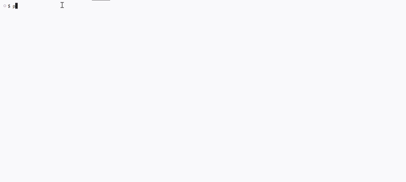

## Purpose of the application

This application is a simple food ordering receipt generator. It collects customer details (name, food item, quantity, and delivery preference), calculates the total cost including service charge and delivery fees, and prints a formatted receipt.

## Tech Stack
List the tools/language used:
Python 3
Standard library only

## How to use

Clone this repository
Navigate to the week_8 folder
Run python main.py
Follow the prompts to enter customer name, food, quantity, and delivery preference
View the generated receipt in the terminal

## Demo
Run the program with python main.py 
